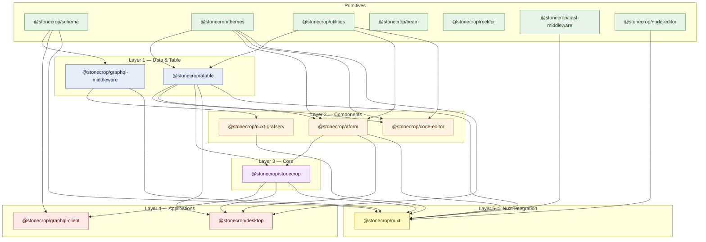

# Stonecrop

 

This repository contains all the packages used in the Stonecrop project. It is managed with [Rush](https://rushjs.io).

### What is it?

These packages in combination create an application that creates a schema driven UI and system of event driven hooks (actual hooks, not the React kind which are not hooks at all). These are available in both the UI and as server middleware.

### Getting Started

This project has the following system dependencies:

- [`pnpm`](https://pnpm.io/) (using yarn or npm will break packages)
- [`rush`](https://rushjs.io/)
- Node v22 LTS ([installation instructions](https://nodejs.org/en/download/package-manager))

```bash
git clone stonecrop
# or
git pull

# install dependencies
cd stonecrop
rush update
rush rebuild

# Work on aform, for example
cd aform

# sometimes, when changing branches or updating dependencies you may have issues
# this command removes and re-links all dependencies
rush purge && rush update && rush rebuild

# Provide changelog for release
rush change

# Stage changes and run linters
rushx lint
```

### Projects

**Foundation**
- [`@stonecrop/schema`](./schema/README.md) — Doctype schema definitions, field types, naming utilities, and GraphQL→doctype converter
- [`@stonecrop/themes`](./themes/README.md) — Shared CSS tokens and design system themes
- [`@stonecrop/utilities`](./utilities/README.md) — Shared helper functions and type utilities
- [`@stonecrop/beam`](./beam/README.md) — UI component library with consistent theming
- [`@stonecrop/rockfoil`](./rockfoil/CHANGELOG.md) — Base configuration and rig package

**Middleware & Data Layer**
- [`@stonecrop/casl-middleware`](./casl_middleware/README.md) — CASL-based authorisation middleware
- [`@stonecrop/graphql-middleware`](./graphql_middleware/README.md) — GraphQL query/mutation middleware using doctype schemas
- [`@stonecrop/graphql-client`](./graphql_client/README.md) — Vue composables for GraphQL data fetching

**Core UI**
- [`@stonecrop/atable`](./atable/README.md) — Advanced data table with Excel-like navigation and editing
- [`@stonecrop/aform`](./aform/CHANGELOG.md) — Schema-driven form components with validation
- [`@stonecrop/code-editor`](./code_editor/CHANGELOG.md) — Code editor component
- [`@stonecrop/stonecrop`](./stonecrop/README.md) — Core orchestration: Registry, HST state management, and workflow engine

**Application**
- [`@stonecrop/desktop`](./desktop/README.md) — Desktop-specific UI patterns and command palette
- [`@stonecrop/node-editor`](./node_editor/README.md) — Visual FSM editor with Vue Flow integration

**Nuxt Integration**
- [`@stonecrop/nuxt`](./nuxt/README.md) — Nuxt module: schema-driven routing, pages, and layouts
- [`@stonecrop/nuxt-grafserv`](./nuxt_grafserv/README.md) — PostGraphile/Grafserv integration for Nuxt

### Dependency Tree


