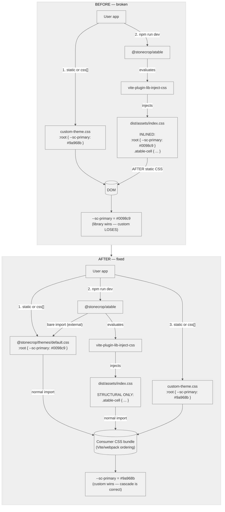

# Stonecrop Theming Plan

> Generated from review of `THEME.md` and full codebase audit, with review feedback from `THEME_PLAN_REVIEW.md` incorporated.
> Status: Plan only — no code changes made yet.

---

## 1. Validated Bugs

### Bug 1: `themes/package.json` exports map — VALID, STILL UNFIXED

**Current state (broken):**
```json
"exports": {
  "./agritheory.css": "./dist/agritheory.css",
  "./dark.css":       "./dist/default.css",
  "./default.css":    "./dist/default.css",
  "./excel.css":      "./dist/default.css",
  "./legal.css":      "./dist/default.css",
  "./verdant.css":    "./dist/default.css",
  "./vue.css":        "./dist/default.css"
}
```

All themes except `agritheory.css` resolve to `default.css`. Users importing `@stonecrop/themes/dark.css` silently get the default blue theme. This must be fixed regardless of the broader theming strategy.

**Fix:** Point each export to its own built file (`./dist/dark.css`, `./dist/excel.css`, etc.).

---

### Bug 2: atable/aform bundle default theme into JS-injected CSS — VALID, STILL UNFIXED

**Root cause:** Seven `atable` Vue SFCs and `aform/src/theme/login.css` do `@import url('@stonecrop/themes/default.css')` inside their `<style>` blocks. Vite bundles all of these into `dist/assets/index.css` per package, then `vite-plugin-lib-inject-css` injects `import './assets/index.css'` into the JS bundle.

**Impact:** Any static CSS override file (e.g. `fab-theme.css`) is loaded first. When the JS bundle evaluates, it injects a `<style>` tag containing a full `:root { --sc-primary-color: #0098c9; ... }` block, which **overwrites** the user's custom values.

**Confirmed active imports:**
- `atable/src/components/ACell.vue`
- `atable/src/components/ARow.vue`
- `atable/src/components/ATable.vue`
- `atable/src/components/ATableHeader.vue`
- `atable/src/components/ATableModal.vue`
- `atable/src/components/ARowActions.vue`
- `atable/src/components/AExpansionRow.vue`
- `aform/src/theme/login.css`

**Already commented out (safe):**
- `aform/src/components/AForm.vue`
- `aform/src/components/form/ADatePicker.vue`
- `aform/src/components/utilities/Login.vue`

---

### Bug 2b: `desktop` also inlines theme into its built CSS artifact

`desktop/vite.config.ts` does not externalize `@stonecrop/themes` and does not use `libInjectCss`, but its built `dist/desktop.css` (34 KB) currently contains a `:root` block from inlined transitive theme imports. Adding `import '@stonecrop/themes/default.css'` to `desktop/src/index.ts` without also externalizing it would recreate Bug 2 at the desktop level.

**Fix:** Add `@stonecrop/themes` to `desktop/vite.config.ts`'s `rollupOptions.external` array (using the regex form, see Step 3).

---

## 2. Rejected Approaches

### Rejected: Remove all bundled theme imports and make users import themes manually

**Why rejected:** If a user app imports `@stonecrop/atable` directly (without `@stonecrop/desktop` or `@stonecrop/nuxt`), the component would render without any `:root` variable definitions. `--sc-primary-color`, `--sc-row-border-color`, `--sc-font-family`, etc. would all fall back to browser defaults. Tables and forms would look broken (no colors, no fonts, no spacing). This is a poor DX and contradicts the expectation that components "just work" when imported.

**Who would have been affected:**
- `examples/atable/histoire.setup.ts` (imports atable directly)
- `examples/aform/histoire.setup.ts` (imports aform directly)
- Any third-party app importing atable/aform standalone

### Rejected: The "base + override" theme pattern

**What it is:** The current theme files (`dark.css`, `agritheory.css`, `legal.css`, `excel.css`, `vue.css`, `verdant.css`) only define ~10–15 variable overrides and rely on the user first importing `default.css` to establish the full `:root` baseline.

**Why rejected:** It places cognitive load on the user app author. If they forget to import the base first, ~50 variables remain undefined and components break silently. Debugging "why is my table missing fonts/borders/colors?" is harder than "why is my color slightly wrong?". Self-contained theme files are easier to reason about and debug.

### Considered: `@layer` (Cascade Layers)

Two variants were considered:

**Rejected: Wrapping ALL library CSS in a layer**

**What it is:** Wrapping the library's entire CSS in `@layer stonecrop { ... }` so that any unlayered user CSS automatically wins via cascade priority, regardless of load order.

**Why rejected:**

1. **It's a band-aid, not a fix.** The real problem is that theme variables are incorrectly bundled into the structural CSS artifact. `@layer` would let us keep that broken architecture alive by just lowering the library CSS priority.
2. **Structural styles would also be de-prioritized.** If all of `dist/assets/index.css` is wrapped in `@layer`, then `.atable-cell`, `.atable-row`, etc. all become lower priority than user CSS.
3. **No build bloat reduction.** The 7 atable Vue SFCs would still each inline the theme into `dist/assets/index.css`. The built file would still contain duplicated `:root` blocks.
4. **Cross-package layer coordination.** `atable`, `aform`, and `desktop` would need to agree on layer names and ordering conventions. This adds cognitive overhead across package boundaries.

**Adopted: Wrapping ONLY `:root` defaults in `@layer stonecrop-base`**

The narrow application — wrapping *only* `_variables.css`'s `:root` block in `@layer stonecrop-base { ... }` — is **adopted** (see Step 5). This protects the variable defaults from clobbering by async-chunk CSS without de-prioritizing structural styles. It is not the same as wrapping the entire library in a layer.

---

## 3. Role of `vite-plugin-lib-inject-css`

`vite-plugin-lib-inject-css` is used in `atable` and `aform`. It is **not the problem**.

### What the plugin does
- During the library build, it inspects each JS chunk's `viteMetadata` to see which CSS assets Vite emitted for that chunk.
- It injects `import './assets/index.css'` at the top of the built JS file.
- When a consumer app imports `@stonecrop/atable`, the consumer's bundler resolves the CSS import and includes the structural styles in the app's CSS bundle.
- The plugin does **not** do runtime `document.createElement('style')` — it delegates CSS handling to the consumer's bundler, which is SSR-safe.

### Evidence in Stonecrop's built output
```js
// atable/dist/atable.js (line 3)
import './assets/index.css';

// aform/dist/aform.js (line 3)
import './assets/index.css';
```

### Why it is currently getting in the way
The plugin is doing its job correctly. The issue is the **payload**: because 7 atable Vue SFCs and `aform/src/theme/login.css` each do `@import url('@stonecrop/themes/default.css')` inside their `<style>` blocks, Vite inlines the entire theme into `dist/assets/index.css`. The plugin then auto-injects this CSS, which contains `:root { --sc-primary-color: #0098c9; ... }`. When the consumer's app has already loaded custom overrides, the JS-injected `:root` block **clobbers** them.

### Verdict: KEEP the plugin
Removing the plugin would force consumers to manually import `@stonecrop/atable/styles` and `@stonecrop/aform/styles` to get structural styles. This is a DX regression. The correct fix is changing **what** gets bundled into `dist/assets/index.css`, not removing the auto-injection mechanism.

---

## 4. Final Recommended Plan

### Principle: Components "Just Work" — Themes Are Overrideable

The default theme variables should always be present when a component is used, so nothing looks broken. Any custom CSS file can then override specific `--sc-*` variables and **win** because of standard CSS cascade rules (same specificity, last-defined wins).

**Architectural shift:**
1. Remove theme `@import` from component `<style>` blocks so `dist/assets/index.css` contains **only structural styles**.
2. Keep `libInjectCss()` so structural CSS is still auto-injected.
3. Add `import '@stonecrop/themes/default.css'` to the JS entry points (`atable/src/index.ts`, `aform/src/index.ts`).
4. Mark `@stonecrop/themes` as **external** in `rollupOptions.external` so the theme is NOT inlined into `dist/assets/index.css` during the library build. Instead, it remains as a bare import in the built JS for the **consumer's bundler** to resolve.
5. In the consumer's app, the theme CSS participates in normal bundling and ordering alongside all other static CSS. User overrides loaded after it naturally win via the cascade.

---

### Diagrams



> **Caveat:** The diagram illustrates the Vite / SPA case where all CSS is bundled together and import order equals cascade order. Nuxt async route chunks can inject CSS at navigation time; the `@layer stonecrop-base` wrapper in `_variables.css` makes the variable defaults subordinate to unlayered user CSS regardless of load order.

---

### Step 1: Fix `themes/package.json` exports (Bug 1)

Update the `exports` map so each theme resolves to its own built file.

```json
"exports": {
  "./agritheory.css": "./dist/agritheory.css",
  "./dark.css":       "./dist/dark.css",
  "./default.css":    "./dist/default.css",
  "./excel.css":      "./dist/excel.css",
  "./legal.css":      "./dist/legal.css",
  "./verdant.css":    "./dist/verdant.css",
  "./vue.css":        "./dist/vue.css"
}
```

---

### Step 2: Remove `@import url('@stonecrop/themes/default.css')` from component `<style>` blocks

Remove the import from these 7 files:
- `atable/src/components/ACell.vue`
- `atable/src/components/ARow.vue`
- `atable/src/components/ATable.vue`
- `atable/src/components/ATableHeader.vue`
- `atable/src/components/ATableModal.vue`
- `atable/src/components/ARowActions.vue`
- `atable/src/components/AExpansionRow.vue`

Delete this unused file entirely (no imports found anywhere in the repo):
- `aform/src/theme/login.css`

After removal, `atable/dist/assets/index.css` and `aform/dist/assets/index.css` will contain only structural component styles (`.atable-cell`, `.atable-row`, etc.) **without** a `:root` block.

---

### Step 3: Add theme import to JS entry points, mark `@stonecrop/themes` as external, and move to `peerDependencies`

**Critical:** The import specifier being externalized is `@stonecrop/themes/default.css` (a deep subpath), not `@stonecrop/themes` itself. Rollup's string `external` matching requires an exact match, so the external array must use a regex.

**Regex external matcher (all packages):**
```ts
rollupOptions: {
  external: ['vue', 'pinia', /^@stonecrop\/themes(\/|$)/],
  // ... rest unchanged
}
```

**For `atable`:**

Add to `atable/src/index.ts`:
```ts
import '@stonecrop/themes/default.css'
```

Add regex to `rollupOptions.external` in `atable/vite.config.ts` (see matcher above).

**For `aform`:**

Add to `aform/src/index.ts`:
```ts
import '@stonecrop/themes/default.css'
```

Add regex to `rollupOptions.external` in `aform/vite.config.ts`.

**For `desktop`:**

Add to `desktop/src/index.ts`:
```ts
import '@stonecrop/themes/default.css'
```

Add regex to `rollupOptions.external` in `desktop/vite.config.ts`.

**Why this works:**
- The Vue SFC `<style>` blocks no longer contain `@import url('@stonecrop/themes/default.css')`, so `dist/assets/index.css` contains **only structural styles**.
- `libInjectCss()` injects `import './assets/index.css'` into the built JS as before, but now it only auto-injects structural CSS.
- The theme import in `src/index.ts` is kept in the built JS as a bare import because `@stonecrop/themes` is marked external via regex.
- When the consumer's bundler processes `@stonecrop/atable`, it resolves both imports:
  - `@stonecrop/themes/default.css` → included in the consumer's CSS bundle as a normal static CSS file
  - `./assets/index.css` → structural styles included in the consumer's CSS bundle
- Both participate in normal CSS ordering. User overrides loaded after the component import naturally win via the cascade.

**Move `@stonecrop/themes` from `dependencies` to `peerDependencies` in atable, aform, and desktop:**

```json
"peerDependencies": {
  "@stonecrop/themes": ">=0.11.7 <1.0.0",
  "pinia": "^3.0.4",
  "vue": "^3.5.28"
}
```

Why `>=0.11.7` instead of `^0.11.7`? Semver `^0.11.7` resolves to `>=0.11.7 && <0.12.0`. Because `@stonecrop/themes` is on 0.x, even a minor workspace bump (0.12.0) would fail the peerDep check. The wider range prevents false negatives during lockstep monorepo releases while still enforcing a minimum compatible version.

This prevents two copies of `@stonecrop/themes` from coexisting in the consumer's `node_modules`, which would create non-deterministic `:root` ordering.

**Non-Nuxt app example:**
```ts
// main.ts
import '@stonecrop/atable'          // installs plugin + auto-imports theme + structural CSS
import './my-custom-theme.css'      // overrides --sc-* variables, wins via cascade
```

**Bundler caveat:** This pattern requires a bundler with CSS import support. Vite, Webpack, Rollup, and Rspack all handle `import 'pkg/sub/file.css'` correctly. Raw esbuild or Bun without a CSS plugin may fail or skip the import. Document this in the README.

---

### Step 4: Update `@stonecrop/nuxt` module

Add a `theme` option to `ModuleOptions`:

```ts
export interface ModuleOptions {
  // ... existing options ...

  /**
   * Theme CSS path to auto-import via the Nuxt module.
   * Set to `false` to skip the Nuxt-level injection only.
   * Note: component entry points still import default.css automatically.
   * @default '@stonecrop/themes/default.css'
   */
  theme?: string | false
}
```

In `module.ts` setup, add the chosen theme to `nuxt.options.css`:

```ts
if (options.theme !== false) {
  const themePath = options.theme || '@stonecrop/themes/default.css'
  nuxt.options.css.push(themePath)
}
```

**Why `push`:** Nuxt processes the `css` array in order. User entries in the `css` config array naturally come after module-contributed entries. Using `push` means the user's own CSS overrides win without needing explicit ordering logic.

**User override example:**
```ts
// nuxt.config.ts
export default defineNuxtConfig({
  modules: ['@stonecrop/nuxt'],
  stonecrop: {
    theme: '@stonecrop/themes/dark.css',  // or false for manual control
  },
  css: [
    '~/assets/fab-theme.css'  // loaded AFTER dark.css, overrides win
  ]
})
```

**Deduplication note:** `atable/src/index.ts` and `aform/src/index.ts` each contain `import '@stonecrop/themes/default.css'`. In the typical case Vite deduplicates by resolved module ID, so only one copy of the theme CSS is emitted. In cases where deduplication fails (workspace symlinks, Nitro `externals.inline` mismatched paths, etc.), duplicate `:root` blocks — if they appear — are layered and therefore harmless. This is because Step 5 wraps `_variables.css`'s `:root` in `@layer stonecrop-base`. We still include the theme in the Nuxt `css` array to guarantee its presence even if tree-shaking removes the component import.

**Escape hatch — `theme: false`:** Setting `theme: false` only disables the Nuxt module's `nuxt.options.css.push(...)` call. It does **not** prevent `atable/src/index.ts` and `aform/src/index.ts` from pulling in `@stonecrop/themes/default.css` via their entry-point imports, which Vite will include regardless. A Nuxt user who wants to avoid loading the default theme entirely should import the future `./headless` entry point (see Step 8) until that entry point is available. For the MVP, `theme: false` is still useful: it suppresses the extra redundant import at the module level (the default is already injected via the component entry points).

**Fix incorrect README path:** The Nuxt README currently documents `'@stonecrop/themes/default/default.css'` — this path does not exist. It should be `'@stonecrop/themes/default.css'`.

**Caveat — async-chunk cascade ordering:** The Nuxt `css` array only controls static CSS ordering. In apps with code splitting (Nuxt, Vite SPA with lazy routes, Webpack, Rspack), async route chunks inject their CSS at navigation time, potentially after user static CSS. Additionally, Vite's CSS deduplication relies on resolved module ID paths, which can differ under workspace symlinks or Nitro `externals.inline`. If dedupe fails, a duplicate `:root` block could load from an async chunk after the user's custom CSS.

**Resolution:** We address this at two levels:
1. **Primary fix:** Externalizing `@stonecrop/themes` (Step 3) structurally removes `:root` from JS-injected chunks, so the only `:root` source is the single external theme file.
2. **Safety net:** Wrapping `_variables.css`'s `:root` in `@layer stonecrop-base` (Step 5) makes any surviving duplicates subordinate to unlayered user CSS regardless of load order.
3. **Verification:** Integration test verifying custom CSS wins after async chunk navigation (Section 6).

**Browser support:** `@layer` requires Chrome 99+, Firefox 97+, Safari 15.4+ (Mar 2022). These are ~4 years old; `@layer` has been Baseline-widely-available since 2024. This is defensible for a 2026 component library.

---

### Step 5: Audit and clean up dead theme files and scoped `:root` artifacts

| File | Status | Action |
|------|--------|--------|
| `themes/default/_zindex.css` | Pure comments, no CSS rules; documented in `docs/reference/themes.md` | **Do NOT import.** Leave as a documentation file. |
| `themes/default/_form.css` | Almost entirely commented out; only contains placeholder comments | **Delete.** Verify with `git blame` that it is not an in-progress placeholder before removing. |
| `themes/default/_login.css` | Completely empty | **Delete.** |

**Scoped `:root` artifact cleanup:**

`desktop/dist/desktop.css` currently contains `[data-v-7b50ad21]:root`-style scoped declarations — a Vite build artifact from transitive `@import` into scoped SFC `<style>` blocks. These `[data-v-*]:root` selectors match nothing and are harmless dead CSS, but they should be eliminated.

**Action:** After Step 2 removes the SFC `@import`s, rebuild. Verify `desktop/dist/desktop.css` no longer contains `[data-v-*]:root` (and `atable`/`aform` `dist/assets/index.css` similarly). Also grep all atable/aform/desktop SFCs for `:root` inside `<style scoped>` blocks and either un-scope them or move them to a global stylesheet so they never produce this artifact again.

After deletions, `default.css` becomes:
```css
@import url('https://fonts.googleapis.com/css2?family=Arimo:ital,wght@0,400..700;1,400..700&display=swap');
@import url('./_variables.css');
```

**Also: wrap `:root` block in `@layer stonecrop-base`:**

Edit `themes/default/_variables.css` to wrap its `:root` block:

```css
@layer stonecrop-base {
  :root {
    --sc-primary-color: #0098c9;
    /* ... all 64 variables ... */
  }
}
```

The build-time generator (Step 6) must preserve this layer wrapper in all generated alternate theme files. Document the layer name in `themes/README.md` so consumers can opt into explicit layer ordering if they want (e.g. `@layer reset, stonecrop-base, app;`).

---

### Step 6: Make alternate themes self-contained via build-time generation

The alternate themes (`dark`, `agritheory`, `verdant`, `excel`, `legal`, `vue`) currently only override a subset of variables (10–15). If a user imports one directly, ~50 variables are undefined.

**Do NOT manually copy all 64 variables into 7 source files.** That creates a DRY violation — change one default → hand-edit 7 files → drift is inevitable.

**Instead, use a build-time merge:**

1. **Source files** for alternates stay DRY: each contains only its overrides (the current ~10–15 variables).
2. **During the `themes` package build**, a script merges base `_variables.css` with each alternate's overrides and emits a self-contained `dist/<theme>.css`.

Implementation approach:
```ts
// themes/scripts/build-themes.ts
import { readFileSync, writeFileSync } from 'node:fs'

const base = parseVariablesCss(readFileSync('./default/_variables.css', 'utf-8'))

function serializeThemeCss(name: string, vars: Record<string, string>): string {
  const decls = Object.entries(vars).map(([k, v]) => `    ${k}: ${v};`).join('\n')
  return `@layer stonecrop-base {\n  :root {\n${decls}\n  }\n}\n`
}

for (const theme of ['dark', 'agritheory', 'verdant', 'excel', 'legal', 'vue']) {
  const overrides = parseVariablesCss(readFileSync(`./${theme}/${theme}.css`, 'utf-8'))
  const merged = { ...base, ...overrides }
  writeFileSync(`./dist/${theme}.css`, serializeThemeCss(theme, merged))
}
```

This gives users self-contained themes without maintainer footguns.

---

### Step 7: Update internal examples

Update Histoire setup files that import atable/aform directly. Add a comment explaining that theme CSS arrives via the package entry point:

```ts
// examples/atable/histoire.setup.ts
import { install as ATable } from '@stonecrop/atable'
import { install as AForm } from '@stonecrop/aform'

// Theme CSS is imported automatically by atable/aform entry points.
// Do NOT add a direct theme import here — it would duplicate the CSS.
export const setupVue3 = defineSetupVue3(({ app }) => {
  app.use(AForm)
  app.use(ATable)
})
```

Files to update:
- `examples/atable/histoire.setup.ts`
- `examples/aform/histoire.setup.ts`
- `examples/histoire.setup.ts`

Verify `examples/desktop/index.ts` and `examples/docbuilder/index.ts` still work (they already import `@stonecrop/desktop/styles` which should now contain the theme via the desktop entry point).

---

### Step 8: Headless entry point (future enhancement)

After the refactor, `import '@stonecrop/atable'` always drags in `default.css`. A consumer who wants only `dark.css` ships two `:root` blocks (default + dark). Cascade order makes it functionally correct, but it's wasteful.

**Future (post-MVP):** Add a `./headless` export to `atable`, `aform`, and `desktop` (`package.json`):
```json
"./headless": {
  "types": "./dist/atable.headless.d.ts",
  "import": "./dist/atable.headless.js"
}
```
Where `atable.headless.js` is identical to `atable.js` minus the `import '@stonecrop/themes/default.css'` line. Gives advanced consumers total control with zero waste.

**Not required for this refactor.**

---

### Step 9: Document out-of-scope packages

The following packages are confirmed **out of scope** for this theming refactor:

| Package | Status | Action |
|---------|--------|--------|
| `beam` | Ships its own `themes/beam.css` (independent of `@stonecrop/themes`) | File follow-up issue to align with Stonecrop's CSS variable system |
| `code_editor` | Has empty `src/theme/custom_themes.css`, no theme imports | No action needed |
| `node_editor` | No theme imports | No action needed |

**Runtime theme switching — out of scope:**

The plan supports one theme bundled at build time (default or user-selected via the Nuxt module), plus user CSS overrides via cascade. It does **not** support runtime theme switching (e.g. dark-mode toggle, multi-tenant theming). This is a common requirement that may come up; the current plan does not preclude it, but it does not establish the pattern. Keep `_variables.css` self-contained; a future pattern could use `[data-theme="dark"] :root { ... }` overrides loaded once.

---

## 5. Test Strategy

### Failing tests already written

The following test files describe the desired post-refactor state. They **FAIL** against the current built artifacts and will **PASS** after the source changes + rebuild.

#### `atable/tests/build.spec.ts`
```ts
describe('atable build output - theming', () => {
  it('dist/assets/index.css should NOT contain :root variable blocks', () => {
    // FAILS now: current dist/assets/index.css contains :root blocks
    const css = fs.readFileSync(cssPath, 'utf-8')
    expect(css).not.toContain(':root')
  })

  it('dist/atable.js should import theme as external dependency', () => {
    // FAILS now: current atable.js has no @stonecrop/themes import
    const js = fs.readFileSync(jsPath, 'utf-8')
    expect(js).toMatch(/@stonecrop[/\\]themes[/\\]default\.css/)
  })

  it('dist/atable.js should still auto-inject structural CSS', () => {
    // PASSES now: libInjectCss already injects './assets/index.css'
    const js = fs.readFileSync(jsPath, 'utf-8')
    expect(js).toContain("import './assets/index.css'")
  })
})
```

#### `aform/tests/build.spec.ts`
Identical pattern to atable.

#### `themes/tests/build.spec.ts`
```ts
describe('themes package - exports', () => {
  it('each theme export should point to its own file', () => {
    // FAILS now: dark.css, excel.css, etc. all point to dist/default.css
    for (const [key, value] of Object.entries(pkg.exports)) {
      const themeName = key.replace('.css', '')
      expect(value).toBe(`./dist/${themeName}.css`)
    }
  })
})

describe('themes package - self-contained alternate themes', () => {
  it.each(['dark', 'agritheory', ...])(
    '%s.css should define all base variables',
    (themeName) => {
      // FAILS now: alternate themes only define ~10-15 overrides
      const count = countVarsInFile(`dist/${themeName}.css`)
      expect(count).toBeGreaterThanOrEqual(baseVariableCount)
    }
  )

  it.each(['default', 'dark', 'agritheory', 'verdant', 'excel', 'legal', 'vue'])(
    '%s.css should wrap :root in @layer stonecrop-base',
    (themeName) => {
      const css = fs.readFileSync(`dist/${themeName}.css`, 'utf-8')
      expect(css).toMatch(/@layer\s+stonecrop-base\s*\{[\s\S]*:root\s*\{/)
    }
  )
})
```

### Current test results (before any code changes)

```
atable/tests/build.spec.ts
  ✗ dist/assets/index.css should NOT contain :root variable blocks
  ✗ dist/atable.js should import theme as external dependency
  ✓ dist/atable.js should still auto-inject structural CSS

aform/tests/build.spec.ts
  ✗ dist/assets/index.css should NOT contain :root variable blocks
  ✗ dist/aform.js should import theme as external dependency
  ✓ dist/aform.js should still auto-inject structural CSS
```

### Testable claims not yet covered by code (promoted to required-before-merge)

| Claim | Test | Priority |
|-------|------|----------|
| User static CSS overrides win via cascade | Integration test: build a minimal Vite app importing `@stonecrop/atable` after custom CSS, assert `getComputedStyle` returns custom value | **Required** |
| Nuxt `theme` option ordering | Extend `nuxt/test/basic.test.ts` with fixture app to inspect rendered `<link>` / `<style>` order after async chunk navigation | **Required** |
| `@stonecrop/desktop` self-contained | Verify `desktop/src/index.ts` contains `import '@stonecrop/themes/default.css'` (unit test) | **Required** |
| Alternate themes are self-contained | Add to `themes/tests/build.spec.ts`: verify each `dist/*.css` file defines ≥ 64 variables and wraps `:root` in `@layer stonecrop-base` | **Required** |

### Regression test checklist

- [ ] `atable/tests/build.spec.ts` — all 3 assertions pass
- [ ] `aform/tests/build.spec.ts` — all 3 assertions pass
- [ ] `themes/tests/build.spec.ts` — exports map + self-contained assertions pass
- [ ] Integration: Vite SPA with custom CSS — custom variable wins
- [ ] Integration: Nuxt with async chunks + custom CSS — custom variable wins after navigation
- [ ] Manual: Histoire examples render correctly (visual check)
- [ ] Manual: `examples/desktop/index.ts` still works
- [ ] Manual: `examples/docbuilder/index.ts` still works

---

## 6. Summary of Changes

| Package | File(s) | Change |
|---------|---------|--------|
| `themes` | `package.json` | Fix exports map (Bug 1) |
| `themes` | `default/default.css` | Remove `_form.css` import |
| `themes` | `default/_form.css` | Delete (after `git blame` confirmation) |
| `themes` | `default/_login.css` | Delete |
| `themes` | `dark/dark.css`, `verdant/verdant.css`, etc. | Keep override-only sources; build-time merge emits self-contained `dist/*.css` |
| `themes` | `vite.config.ts` / `scripts/build-themes.ts` | Add build-time theme merge step (Step 6) |
| `atable` | `src/components/*.vue` (7 files) | Remove `@import url('@stonecrop/themes/default.css')` |
| `atable` | `src/index.ts` | Add `import '@stonecrop/themes/default.css'` |
| `atable` | `vite.config.ts` | Add `/^@stonecrop\/themes(\/|$)/` to `rollupOptions.external` |
| `atable` | `package.json` | Move `@stonecrop/themes` from `dependencies` to `peerDependencies` |
| `aform` | `src/theme/login.css` | Delete (unused file) |
| `aform` | `src/index.ts` | Add `import '@stonecrop/themes/default.css'` |
| `aform` | `vite.config.ts` | Add `/^@stonecrop\/themes(\/|$)/` to `rollupOptions.external` |
| `aform` | `package.json` | Move `@stonecrop/themes` from `dependencies` to `peerDependencies` |
| `desktop` | `src/index.ts` | Add `import '@stonecrop/themes/default.css'` |
| `desktop` | `vite.config.ts` | Add `/^@stonecrop\/themes(\/|$)/` to `rollupOptions.external` |
| `desktop` | `package.json` | Move `@stonecrop/themes` from `dependencies` to `peerDependencies` |
| `themes` | `default/_variables.css` | Wrap `:root` block in `@layer stonecrop-base { ... }` |
| `themes` | `scripts/build-themes.ts` | Preserve `@layer` wrapper in generated alternate theme files |
| `themes` | `README.md` | Document `stonecrop-base` layer name and `@layer` browser support baseline |
| `atable`/`aform`/`desktop` | SFC `<style scoped>` blocks | Audit for `:root` selectors; move to global stylesheet or un-scope to prevent `[data-v-*]:root` artifacts |
| `nuxt` | `src/module.ts` | Add `theme` option, `push` to `css` array, update docs |
| `nuxt` | `README.md` | Fix theme path (`default/default.css` → `default.css`), document caveat |
| `examples` | `*/histoire.setup.ts` | Add comments explaining implicit theme import |

---

## 7. Rationale for Final Plan

1. **`vite-plugin-lib-inject-css` is a helper, not the enemy.** The plugin correctly provides "auto-inject structural styles" DX for library consumers. The bug was in the **payload** (theme CSS inlined into `dist/assets/index.css`), not the delivery mechanism.

2. **Components must not be broken out of the box.** Removing all bundled CSS and forcing manual theme imports was rejected because standalone atable/aform usage is a supported use case (Histoire examples, third-party consumers).

3. **Themes must be self-contained for users, DRY for maintainers.** The base + override pattern was rejected for users. Copying variables by hand was rejected for maintainers. Build-time generation bridges both requirements.

4. **Externalization is the correct bundler contract.** Rollup's `external` with a regex matcher correctly leaves `@stonecrop/themes/default.css` as a bare import in the library's ESM output. The consumer's bundler resolves it alongside all their other CSS, preserving normal cascade order. This works in every browser that supports CSS custom properties.

5. **Unimportant files must be deleted.** `_form.css` and `_login.css` are dead files that add noise. `_zindex.css` is a documentation-only file that should not be imported.

6. **Nuxt module should make the happy path automatic.** A configurable `theme` option with `theme: false` as an escape hatch gives good DX without removing control. Using `push` instead of `unshift` lets user CSS naturally override module CSS.

7. **Peer dependencies prevent duplicate `@stonecrop/themes` copies.** Without this, the consumer and the library could each pull in a different version, creating non-deterministic `:root` ordering.

8. **Cascade ordering guarantee in async chunks is solved by `@layer` + integration tests.** Wrapping `_variables.css`'s `:root` in `@layer stonecrop-base` makes the variable defaults deterministically subordinate to unlayered user CSS, regardless of load order or dedupe failures. Integration tests verify the end-to-end behavior in Nuxt with async routes.

---

## Appendix: Open Decisions

### Async-chunk cascade ordering

**Status: Resolved.** `@layer stonecrop-base` on `_variables.css`'s `:root` block + required integration tests. See Step 4 "Caveat — async-chunk cascade ordering" callout and Step 5 for full details. The `@layer` fix is framework-agnostic (works in Vite SPA, Webpack, Rspack, Nuxt) and has zero runtime overhead.

### Headless entry point

**Status: Deferred.** See Step 8. Will be implemented as a future enhancement after the core refactor is merged.

### Runtime theme switching

**Status: Out of scope.** See Step 9. May be revisited after the core refactor is merged.
