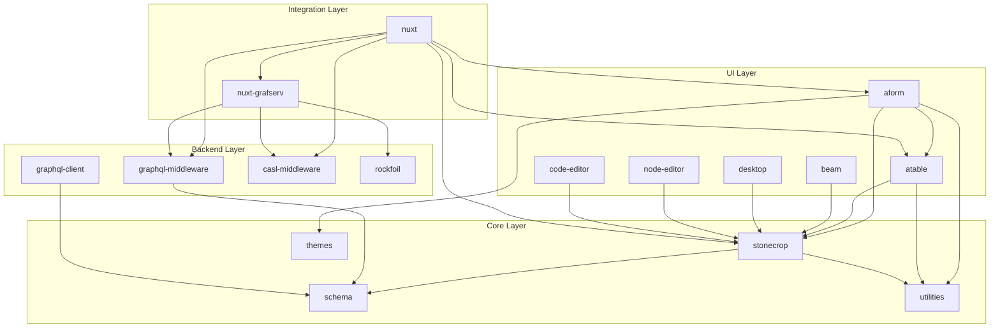

# Architecture Overview

Stonecrop is organized as a Rush monorepo containing interconnected packages for building schema-driven business applications.

## Monorepo Structure

```
stonecrop/
├── aform/              # Form components
├── atable/             # Table components  
├── beam/               # Mobile scanning/MQTT
├── casl_middleware/    # Authorization
├── code_editor/        # Monaco editor
├── common/             # Shared configs
├── desktop/            # Desktop navigation
├── docs/               # Documentation (VitePress)
├── examples/           # Example applications
├── graphql_client/     # GraphQL client
├── graphql_middleware/ # PostGraphile plugin
├── node_editor/        # Visual workflow editor
├── nuxt/               # Nuxt module
├── nuxt_grafserv/      # Nuxt + Grafserv
├── rigs/               # Build tooling
├── rockfoil/           # Server utilities
├── schema/             # Doctype definitions
├── stonecrop/          # Core package
├── themes/             # CSS themes
└── utilities/          # Shared utilities
```

## Package Dependencies



## Package Categories

### Core Packages

| Package | Purpose |
|---------|---------|
| **stonecrop** | Registry, HST state management, composables, operation log |
| **schema** | Doctype definitions, Zod validation schemas |
| **utilities** | Shared utility functions |
| **themes** | CSS theme files |

### UI Components

| Package | Purpose |
|---------|---------|
| **aform** | Schema-driven form rendering with validation |
| **atable** | Advanced tables with tree views, Gantt charts |
| **beam** | Mobile-first scanning, MQTT integration |
| **desktop** | Desktop navigation, command palette |
| **node-editor** | Visual FSM workflow editor |
| **code-editor** | Monaco-based code editing |

### Backend / Middleware

| Package | Purpose |
|---------|---------|
| **graphql-client** | GraphQL client utilities |
| **graphql-middleware** | PostGraphile plugin for Stonecrop operations |
| **casl-middleware** | CASL authorization for GraphQL |
| **rockfoil** | Server-side PostgreSQL utilities |

### Integration

| Package | Purpose |
|---------|---------|
| **nuxt** | Nuxt module for Stonecrop integration |
| **nuxt-grafserv** | Nuxt + Grafserv GraphQL server module |

## Core Concepts

### Doctype

A **Doctype** represents a document type with:
- **Schema**: Field definitions (name, type, validation)
- **Workflow**: XState machine for state transitions
- **Actions**: Functions triggered by field changes or transitions

```typescript
const todoDoctype = new DoctypeMeta(
  'Todo',
  List([
    { fieldname: 'title', fieldtype: 'Data' },
    { fieldname: 'status', fieldtype: 'Select' },
  ]),
  workflow,
  actions
)
```

### Registry

The **Registry** holds all registered doctypes and provides:
- Doctype lookup by name
- Route integration (optional)
- Metadata fetching (optional API integration)

### HST (Hierarchical State Tree)

The **HST** is a tree-based state store with:
- Path-based data access (`doctype.recordId.fieldname`)
- Vue reactivity integration
- Operation logging for undo/redo

### Operation Log

Tracks all HST mutations with:
- Before/after values
- Timestamps and source
- Reversibility status
- Support for undo/redo
- Cross-tab synchronization

## Data Flow

1. **User Input** → Form/table component captures change
2. **handleHSTChange** → Composable processes the change
3. **HST Store** → Updates the hierarchical state tree
4. **Operation Log** → Records the mutation
5. **Field Triggers** → Execute any registered actions
6. **Vue Reactivity** → Updates bound components

## Build System

Stonecrop uses Rush for monorepo management:

- **pnpm** for package management
- **Heft** for TypeScript builds (some packages)
- **Vite** for bundling
- **API Extractor** for documentation generation

### Common Commands

```bash
# Install dependencies
rush update

# Build all packages
rush build

# Build specific package
rush build --to @stonecrop/aform

# Run tests
rushx test

# Generate API docs
rushx docs
```

## Related Documentation

- [HST Design](./hst-design) — State tree architecture
- [State Machines](./state-machines) — XState integration
- [API Reference](/reference/) — Package documentation

