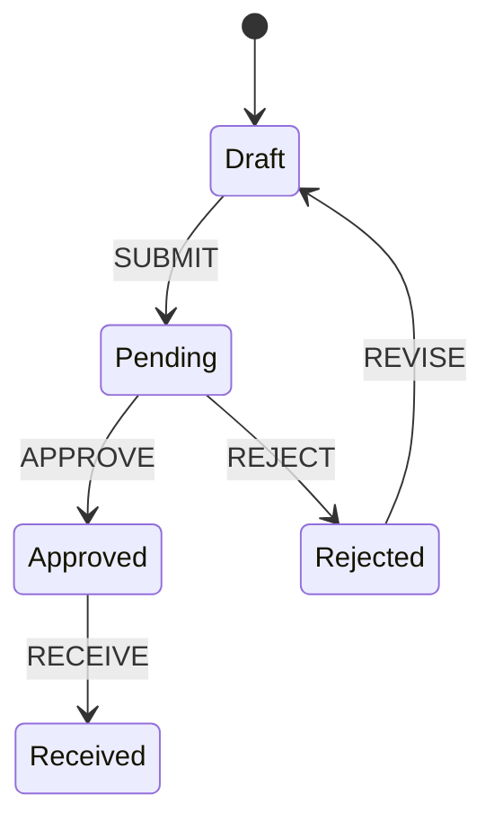

# Doctypes

## What is a Doctype?

A doctype is a definition for a business object. If you're familiar with object-oriented programming, the concept maps directly: the schema defines properties, actions define methods, workflow defines lifecycle, and permissions define access control. If you're coming from database design, think of it as a table definition that also describes behavior and side effects (eg constraints and triggers). If you're coming from business analysis, think of it as the formalization of an entity on a process diagram—the box that has a name, attributes, and rules about what can happen to it.

The term comes from "document type," reflecting the document-oriented (rather than relational) model underneath. But the important insight is that a doctype unifies concerns that traditional architectures scatter across multiple layers.

## The Problem of Fragmentation

Most business software separates structure from behavior:

- **Schema** lives in database migrations or ORM models
- **Validation** scatters across form components and API handlers
- **Workflow** sits in a separate system or gets hardcoded into conditionals
- **Permissions** hide in middleware or decorators
- **Side effects** appear in event handlers, hooks, and callbacks

This separation creates friction. Understanding "what is a Purchase Order?" requires reading five different files. Changing how Purchase Orders behave means editing across multiple layers. The mental model fragments, and the implementation drifts from whatever documentation originally described it.

Doctypes unify these concerns. A single definition tells you everything about an entity: what fields it has, what states it can be in, what happens when things change, and who can do what.

## The Four Concerns

A doctype addresses four distinct concerns:

**Schema** defines the shape of data. Field definitions declare types, labels, and constraints. This drives both validation and UI rendering—forms and tables read from the same source of truth.

**Workflow** models the document's lifecycle as explicit states and transitions. Rather than implicit conditionals scattered through code (`if status == 'pending' and user.can_approve`), the valid paths are declared upfront and enforced by a state machine.

**Actions** connect triggers to behavior. When a field changes or a workflow transition fires, actions define what happens. This is where validation, calculations, notifications, and side effects live—visible and discoverable rather than hidden in hooks. Actions that make no changes to the state of the record in question can be thought of as side effects: print, email, etc.

**Permissions** control access at the doctype level. Who can read, create, modify, or transition documents? In practice, the doctype boundary often exists precisely *because* it's a permission boundary.

Not every doctype needs all four. Log-like, immutable table data might only need schema. But when an entity has meaningful lifecycle and access control requirements, the doctype structure provides a place for each concern. A doctype is intended to encapsulate as much of business concern of that document as possible in one record without compromising its functionality or requiring repetitive programming.

## Workflows and Business Process Design

State machines aren't a programmer abstraction imposed on business logic. They're a formalization of how business analysts already model processes.

Consider how a business analyst might diagram a purchase order workflow:

This is a state machine. The boxes are states, the arrows are transitions. Every BPMN diagram, every approval flowchart, every swim lane diagram is a state machine—just drawn without formal semantics that a computer can execute.

The gap between these diagrams and running software is where documentation rots and implementation drifts. The analyst draws a flowchart. The developer interprets it into conditionals and status fields. Over time, edge cases accumulate, the code diverges from the diagram, and nobody is sure which one is authoritative.

Stonecrop workflows close this gap. The state machine in the doctype definition *is* the diagram, made executable. Business stakeholders can read and validate it because it maps to models they already understand. Developers implement against it because it enforces the rules automatically. When the process changes, the workflow definition changes, and both documentation and implementation update together.

This isn't novel—it's established practice from business process management, applied at the application layer rather than in a separate BPM system.

## Storage Agnosticism

Stonecrop makes no opinions about the type of persistent storage behind the GraphQL layer, though it is generally designed with relational databases in mind.

This is a deliberate architectural choice. The doctype defines structure and behavior for the application layer. How documents are actually stored—PostgreSQL, MongoDB, a combination, something else entirely—is a separate concern. The GraphQL schema provides the contract; the resolvers behind it can talk to whatever storage makes sense for your deployment. The use of projects like PostGraphile and Hasura can jump start the accessibility of the backend data and allow for progressive adoption of Stonecrop features.

## Design Principles

Doctypes embody a few key principles:

**Colocation over separation.** Keep related things together. A doctype's schema, workflow, actions, and permissions belong in the same definition because they're all aspects of the same concept. This matters especially for transactional documents—invoices, purchase orders, contracts—that are external-facing and temporally significant. These documents often move into immutable states (submitted, posted, filed) where further modification is prohibited. Colocating the workflow that enforces immutability with the schema it protects makes that relationship explicit and auditable.

**Explicit over implicit.** State machines make lifecycle visible. Action maps make constraints, validations and side effects discoverable. Permission rules are declared, not scattered. You should be able to understand a doctype by reading its definition.

**Convention over configuration.** Where patterns repeat, conventions reduce boilerplate. The distinction between field actions (lowercase) and workflow transitions (UPPERCASE) is one example: a naming convention provides automatic routing without extra wiring.

**Composition over inheritance.** Actions are named functions that can be shared across doctypes. Workflows are data structures that can be generated or combined. The pieces are meant to be mixed and matched, not locked into inheritance hierarchies.
