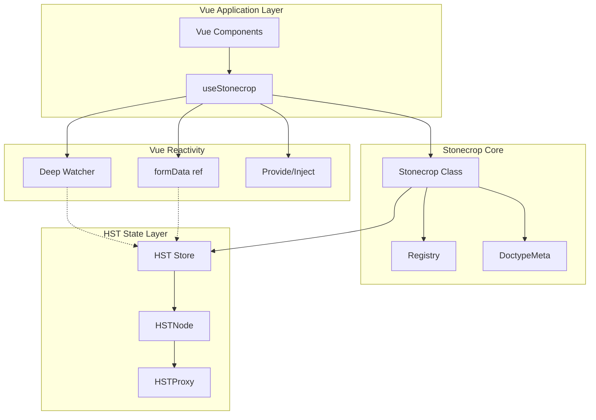
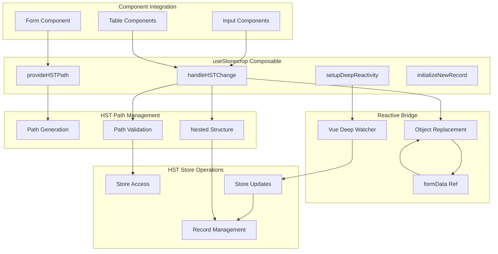
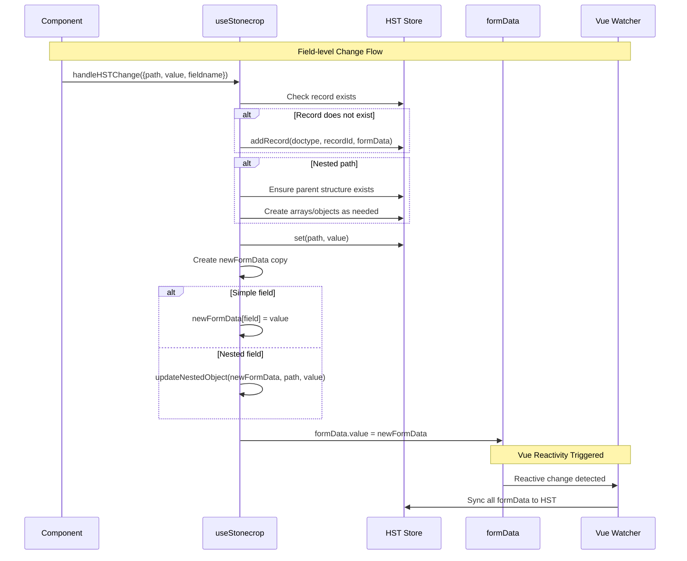
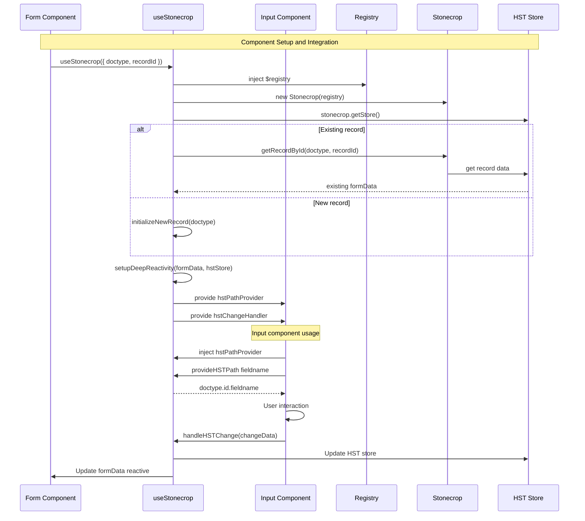
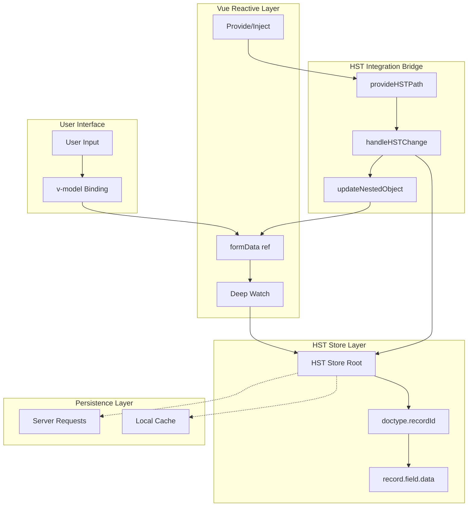

# HST Design

The Hierarchical State Tree (HST) is Stonecrop's core state management system. It provides a tree-based data structure with path-based navigation, Vue reactivity integration, and automatic operation logging.

## High-Level Architecture



## HST Reactive Integration

The `useStonecrop` composable bridges Vue's reactivity system with the HST store.



## Field Change Flow

When a user modifies a field, the following sequence occurs:



## Component Integration

Form and input components integrate with HST through provide/inject:



## Data Flow Architecture

The complete data flow from user input to persistence:



## Path Structure

HST uses dot-notation paths to address data:

```
doctype.recordId.fieldname
```

For example:
- `Todo.123.title` - The title field of Todo record 123
- `User.abc.profile.email` - Nested email in user profile
- `Order.456.items.0.quantity` - First item quantity in an order

## Operation Log Integration

Every HST mutation is tracked in the Operation Log:

1. **Reversible operations**: `set`, `delete`, `batch`
2. **Non-reversible operations**: `transition`, `action`

This enables:
- Undo/redo functionality
- Cross-tab synchronization
- Audit trails
- Time-travel debugging

## Related Documentation

- [State Machines](./state-machines) — XState transition integration
- [Stonecrop API Reference](/reference/stonecrop) — Full API documentation

