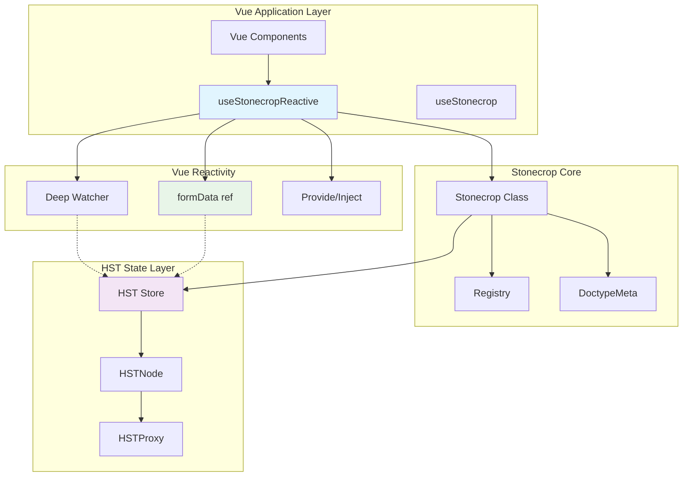
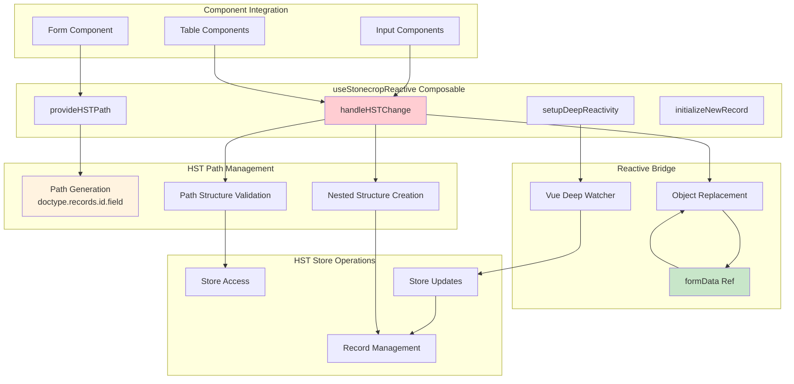
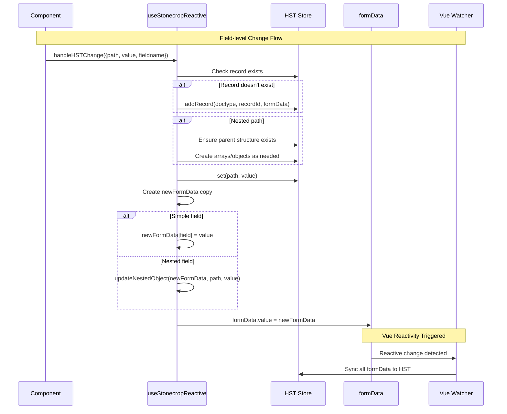
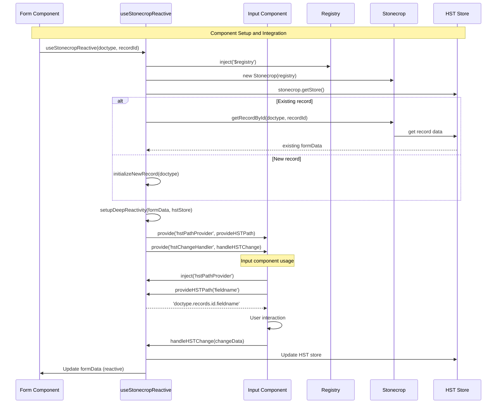
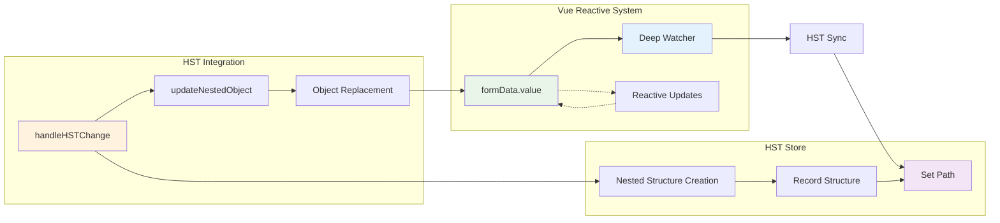
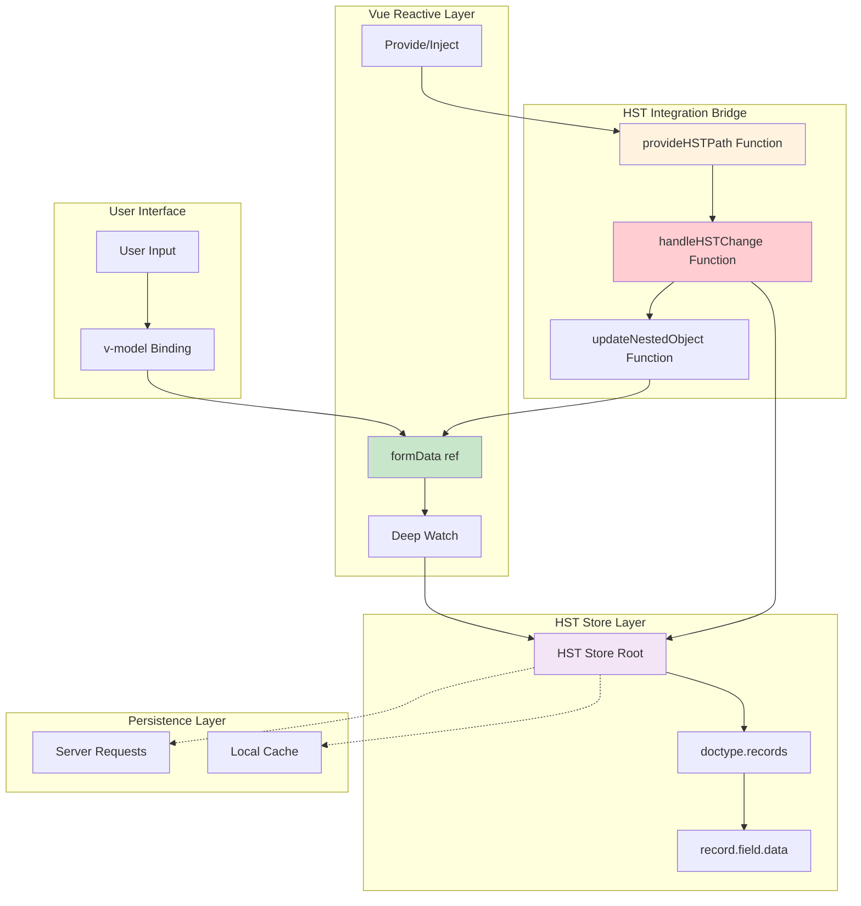

### High-Level Architecture Diagram

### HST Reactive Integration Architecture

### Field Change Sequence Diagram

### Component Integration Sequence

### Deep Reactivity Flow

### Data Flow Architecture

